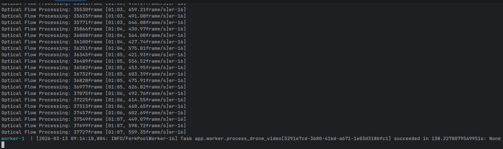
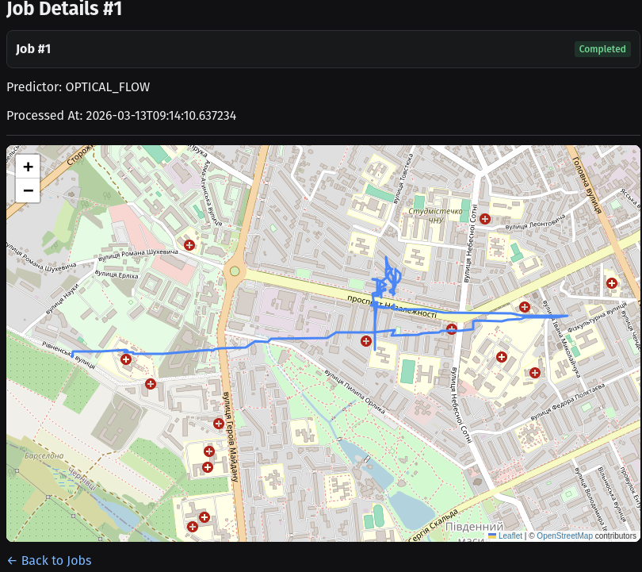
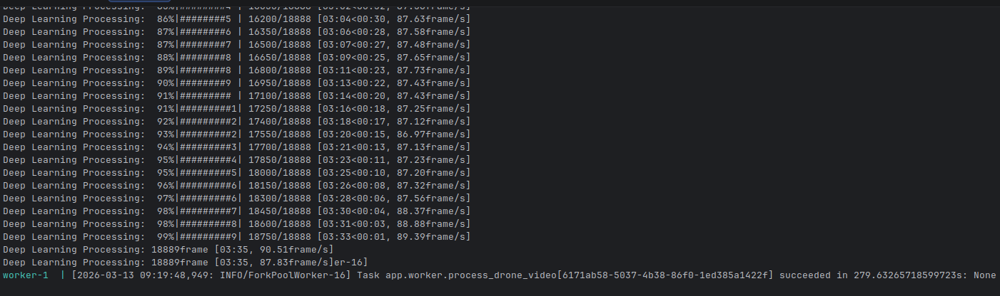
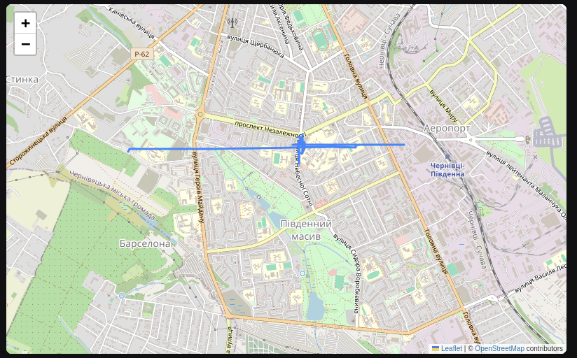

# Drone Path Platform

A distributed, GPU-accelerated web application that predicts and extracts geographical flight trajectories from drone video footage. 

Users can submit a Google Drive link to a drone video along with starting coordinates. The platform processes the video using Deep Learning and Optical Flow models to calculate camera movement, generating a GeoJSON trajectory that is dynamically rendered on an interactive map.

## 🚀 Tech Stack

* **Frontend:** [Reflex](https://reflex.dev/) (Python-based UI), Folium (Map rendering)
* **Backend:** FastAPI, SQLAlchemy, GeoAlchemy2, PostgreSQL, Redis
* **Task Queue:** Celery
* **Machine Learning:** PyTorch, OpenCV, Torchvision (RAFT models)
* **Infrastructure:** Docker, Docker Compose, Nvidia Container Toolkit

## 📋 Prerequisites

To run the machine learning models at full speed, this project requires a CUDA-compatible Nvidia GPU.

### 1. Install Docker
If you do not have Docker installed, run the following commands (Ubuntu/Debian):
```bash
# Add Docker's official GPG key and repository
sudo apt-get update
sudo apt-get install ca-certificates curl
sudo install -m 0755 -d /etc/apt/keyrings
sudo curl -fsSL [https://download.docker.com/linux/ubuntu/gpg](https://download.docker.com/linux/ubuntu/gpg) -o /etc/apt/keyrings/docker.asc
sudo chmod a+r /etc/apt/keyrings/docker.asc

echo \
  "deb [arch=$(dpkg --print-architecture) signed-by=/etc/apt/keyrings/docker.asc] [https://download.docker.com/linux/ubuntu](https://download.docker.com/linux/ubuntu) \
  $(. /etc/os-release && echo "$VERSION_CODENAME") stable" | \
  sudo tee /etc/apt/sources.list.d/docker.list > /dev/null

# Install Docker Engine
sudo apt-get update
sudo apt-get install docker-ce docker-ce-cli containerd.io docker-buildx-plugin docker-compose-plugin


### 2. Install Nvidia Container Toolkit (Optional but Highly Recommended)
To allow Docker containers to access your host machine's GPU for PyTorch inference, install the nvidia-container-toolkit:


```bash
# Configure the repository
curl -fsSL [https://nvidia.github.io/libnvidia-container/gpgkey](https://nvidia.github.io/libnvidia-container/gpgkey) | sudo gpg --dearmor -o /usr/share/keyrings/nvidia-container-toolkit-keyring.gpg \
  && curl -s -L [https://nvidia.github.io/libnvidia-container/stable/deb/nvidia-container-toolkit.list](https://nvidia.github.io/libnvidia-container/stable/deb/nvidia-container-toolkit.list) | \
    sed 's#deb https://#deb [signed-by=/usr/share/keyrings/nvidia-container-toolkit-keyring.gpg] https://#g' | \
    sudo tee /etc/apt/sources.list.d/nvidia-container-toolkit.list

# Install the toolkit
sudo apt-get update
sudo apt-get install -y nvidia-container-toolkit

# Configure Docker to use it and restart the daemon
sudo nvidia-ctk runtime configure --runtime=docker
sudo systemctl restart docker
```


# 🛠️ Getting Started
Clone the repository:

```bash
git clone [https://github.com/danilliadovwork/drone-path-platform.git](https://github.com/danilliadovwork/drone-path-platform.git)
cd drone-path-platform
```
```bash
docker compose up --build -d
(Note: The initial build will take several minutes as it downloads the PyTorch CUDA wheels and RAFT model weights).
```

Verify GPU Access:
Ensure the Celery worker container has successfully attached to your GPU:

```Bash
docker compose exec worker nvidia-smi
```

## 🛠️ Development Commands (Makefile)

To simplify managing the Docker containers, this project includes a `Makefile`. It provides quick shortcuts for building, starting, stopping, and debugging both the standard (CPU) and GPU-accelerated environments.

*(Ensure you have `make` installed on your system to use these commands).*

### 🖥️ CPU Environment
Commands for the standard `docker-compose.yml` stack.

| Command | Description |
| :--- | :--- |
| `make up` | Start the standard CPU stack in the background. |
| `make build` | Build the CPU stack Docker images. |
| `make down` | Stop and remove the CPU stack containers. |

### 🎮 GPU Environment
Commands for the CUDA-enabled `docker-compose.gpu.yml` stack.

| Command | Description |
| :--- | :--- |
| `make up-gpu` | Start the GPU-accelerated stack in the background. |
| `make build-gpu` | Build the GPU stack Docker images. |
| `make down-gpu` | Stop and remove the GPU stack containers. |

### 🔍 Logs & Utilities
Commands for monitoring and resetting your local environment.

| Command | Description |
| :--- | :--- |
| `make logs` | Tail combined logs for all running services. |
| `make logs-worker` | Tail logs specifically for the Celery ML worker. |
| `make logs-backend` | Tail logs specifically for the FastAPI backend. |
| `make clean` | Stop containers and remove volumes (**WARNING: Wipes local database**). |

### 💻 Development & Shell Access
Shortcuts for interacting with the database and internal container shells.

| Command | Description |
| :--- | :--- |
| `make shell-backend` | Open a bash shell inside the backend container. |
| `make shell-worker` | Open a bash shell inside the Celery worker container. |
| `make db-shell` | Open `psql` directly inside the PostgreSQL container. |
| `make migrate` | Run Alembic database migrations (`alembic upgrade head`). |
| `make makemigrations m="msg"`| Autogenerate a new Alembic migration with your commit message. |

# 🖥️ Usage
Open your browser and navigate to http://localhost:3000.

Enter a valid Google Drive link containing a drone video (.mp4, .mkv, etc.).

Input the starting Latitude and Longitude (e.g., 50.13, 36.27).

Select your Path Predictor Type (OPTICAL_FLOW or DEEP_LEARNING).

Click Submit.

The UI will provide real-time WebSocket notifications as the video is downloaded, processed by the GPU, and completed. Click the completed job notification to view the generated geographical trajectory on the interactive map.


## 📊 Processing Results & Model Comparison

The platform currently supports two different methods for predicting the drone's flight path: **Optical Flow** and **Deep Learning**. Based on our benchmarking with standard drone footage, there are significant differences in both processing speed and trajectory accuracy.

### 1. Optical Flow (Recommended)
The Optical Flow estimator proved to be the superior model for this specific use case, offering both higher performance and better real-world accuracy.

* **Performance:** Highly efficient on the GPU. The worker processed the footage at roughly **450 to 650 frames per second**, completing the entire job in just **138 seconds**.
* **Trajectory Accuracy:** The generated map shows a highly detailed and realistic flight path. It accurately captures granular drone movements, including turns, course corrections, and organic deviations.

<p align="center">
  
  
</p>

### 2. Deep Learning
The Deep Learning estimator, while functional, struggled to capture the nuance of the flight path and was significantly more computationally expensive.

* **Performance:** Considerably slower due to the heavier neural network architecture. The worker averaged around **87 to 90 frames per second**, taking **279 seconds** to complete the same video (roughly twice as long as Optical Flow).
* **Trajectory Accuracy:** The resulting map displays a highly rigid, nearly straight line. The model over-smoothed the data, failing to register the subtle geographical deviations and turns present in the actual flight.

<p align="center">
  
  
</p>

### 🔍 Conclusion
For the best balance of speed and accuracy, it is highly recommended to select **`OPTICAL_FLOW`** as the path predictor type when submitting new jobs. The Deep Learning model remains available for experimental and comparative purposes.
